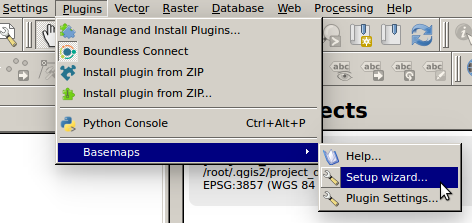
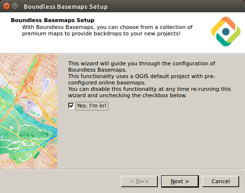
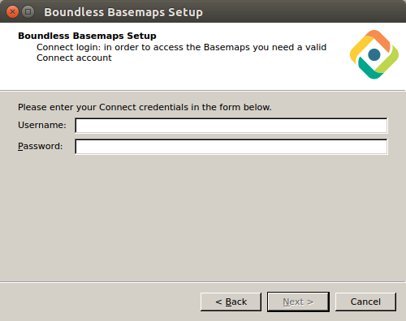
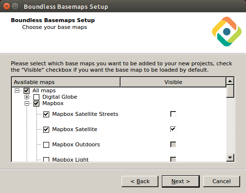
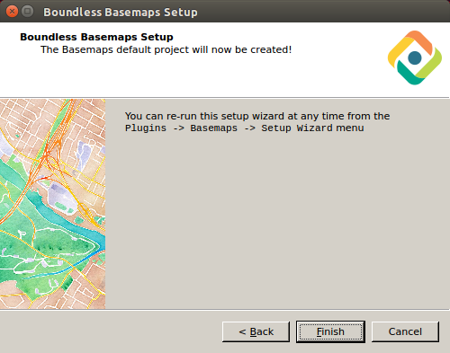
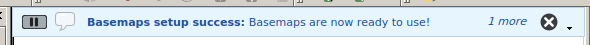
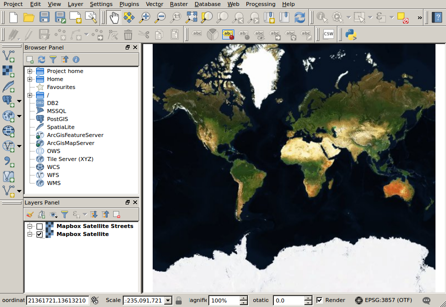

.. (c) 2016 Boundless, http://boundlessgeo.com
   This code is licensed under the GPL 2.0 license.

.. _usage:

Usage
=====

If you are using |BLQGIS|, the |current_plugin| setup wizard runs
automatically on the first time you launch QGIS.

Otherwise, you can run the setup wizard by going to :menuselection:`Plugins
--> Basemaps --> Setup wizard...`.

The :guilabel:`Boundless Basemap Setup` dialog opens, which will guide you
through the configuration of Boundless Basemaps. This allows you to select which
basemaps you wish to add to all your new projects. If you wish to use this
functionality, make sure to enable the :guilabel:`Yes: I'm in!` option and click
:guilabel:`Next >`.

If you haven't done it already, you will be asked to enter your `Connect
Credentials <https://connect.boundlessgeo.com/>`_. Enter the credentials and
click :guilabel:`Next >`.

From the list of available maps, select the ones you want to add to your new
projects by enabling the checkboxes beside their names. Additionally, use the
checkboxes in the :guilabel:`Visible` to choose the ones that should load by
default. Click :guilabel:`Next >`

In the final dialog of the wizard, click :guilabel:`Finish` to apply the
settings and close the :guilabel:`Boundless Basemap Setup` dialog.

A message in QGIS's main window informs that the setup was successful.

If you already had a default project set, another message informs that **A
backup copy of the previous default project has been saved to
/root/.qgis2//project_default-2017-04-13-01:32:30.qgs**.

Now, when you open a new project, the default project will load all selected
layers, showing only the ones you decided to be visible.

.. note::

   If you wish to change the default basemaps selection or even cancel the
   use of this functionality, all you need to do is re-run this wizard from
   :menuselection:`Plugins --> Basemaps --> Setup wizard...`